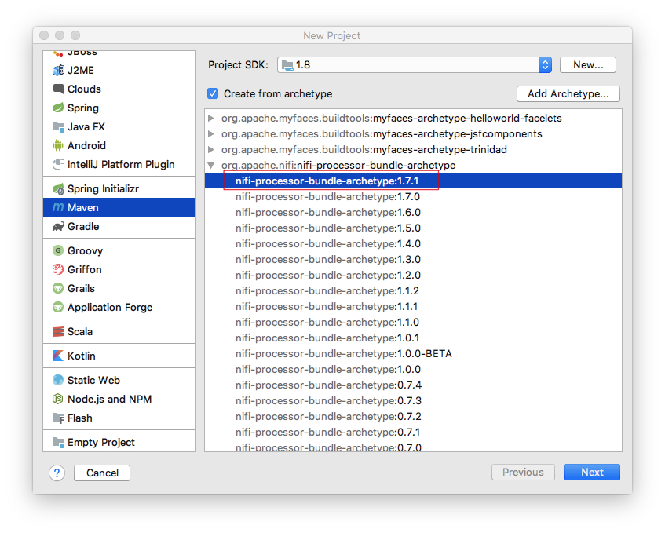

# 
在Apache NiFi上创建自定义的Processors和Controller Services 
      
### 配置：

| 系统 | Apache NIFI | Java Version | Maven Version | Intellj IDEA |
| ------ | ------ | ------ | ------ | ------ |
| MacOS 10.13.4 | 1.7.1 | 1.8.0_181 | 3.5.4 | Intellj IDEA 2018.2.1 | 

### 前言：

### 创建自定义Processors的步骤：  

1. 打开Intellj IDEA 创建新工程，使用archetype进行创建。  

2. 填入groupId，artifactId，version等属性。     

3. 添加属性artifactBaseName及值（任意）。

4. 完成创建。点击reimport all maven project（红圈）。

5. 点击package，构建nar包。生成 nifi-sample-nar-1.0.0.nar。

6. 拷贝nifi-sample-nar-1.0.0.nar到nifi lib目录。

7. 运行nifi start
8. 打开http://127.0.0.1:8080/nifi/
9. 查看Add Processor窗口。

### 创建自定义Controller Services的步骤：
1. 打开Intellj IDEA 创建新工程，使用archetype进行创建。  

2. 填入groupId，artifactId，version等属性。     
  
3. 添加属性artifactBaseName及值（任意）。

4. 完成创建。点击reimport all maven project（红圈）。

5. 分别依次如下图点击package，构建nar包。生成 nifi-sample2-nar-1.0.0.nar和nifi-sample2-api-nar-1.0.0.nar。

6. 拷贝nifi-sample2-nar-1.0.0.nar和nifi-sample2-api-nar-1.0.0.nar到nifi lib目录。

7. 运行nifi start
8. 打开http://127.0.0.1:8080/nifi/
9. 点击右上角Controller Settings，打开NiFi Settings。

### 使用Apache Nifi自定义Controller Services创建自定义Processors的步骤：
1. 用Intellj IDEA打开上面创建的自定义Processors项目。拷贝自定义Controller Services项目内的nifi-services和nifi-services-api目录到自定义Processors项目。

2. 拷贝下图1圈红的到图2和图3。 图4添加模块到pom文件。

3. 将自定义Controller Services作为属性添加到MyProcessor.class。（pom.xml添加依赖）

4. 点击package，构建nar包。生成nifi-sample-nar-1.0.0.nar。

5. 拷贝nifi-sample-nar-1.0.0.nar到nifi lib目录。

6. 运行nifi start
7. 打开http://127.0.0.1:8080/nifi/
8. 查看Add Processor窗口。

###  谢谢各位支持： 

